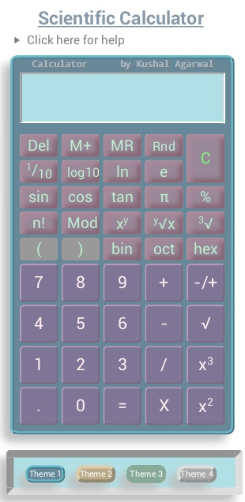
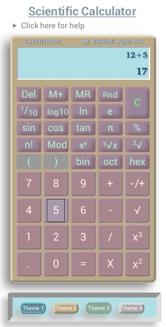
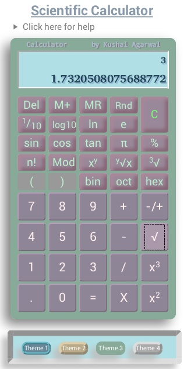

<h3>Scintific Calculator</h3>
    <h4>It can perform these features;</h4>
    <b>
    <ol>
    <li>Work as scintific calculator</li>
    <li>Full functional</li>
    <li>4 Themes available</li>
    </ol>
   <h3> Languages used </h3>
   <ul>
   <li>Html</li>
   <li>Css</li>
   <li>Javascript</li>
   </ul>
   <h4>You can find the demo <a href="https://scintific-calculator.netlify.app">here</a></h4>
   <h3>There are some screenshots please see</h3>
   </img>
    
   </img>
    
   </img>
